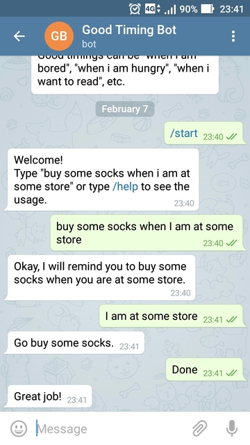

# Good Timing Bot [](https://travis-ci.org/johnlinp/telegram-good-timing-bot)

It is a [Telegram](https://telegram.org/) Bot to help you find a good timing to do things.


## Example




## What Can Be a "Timing"?

Good timings can be:

- "when i am bored"
- "when i am hungry"
- "when i want to read"

and more, whatever you want.

## Unit Tests

To run unit tests, you have to install `mocha` first:

```
sudo npm install -g mocha
```

And then:

```
npm test
```
